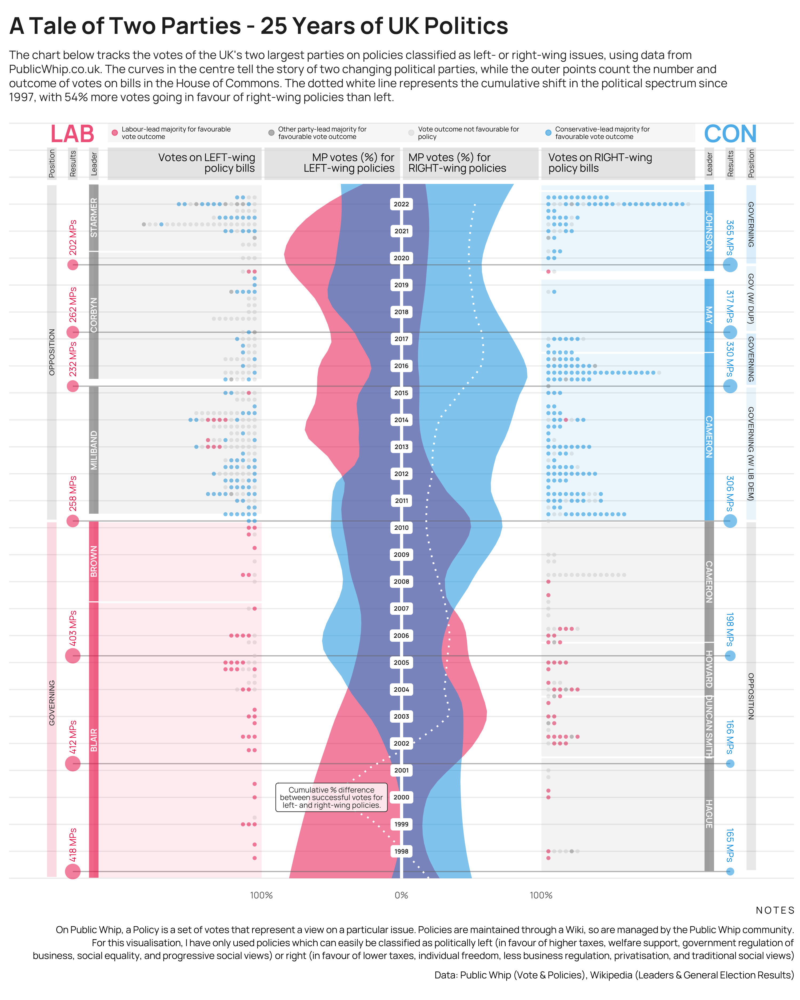

```{r setup, include=FALSE}
knitr::opts_chunk$set(echo = TRUE)
```


## Visualisation



## Data

Policies and parliament votes data were scraped using the rvest package from [Public Whip](https://www.publicwhip.org.uk/)

```{r echo=FALSE}
df <- read.csv("data/all_labelled_policies.csv")

knitr::kable(df |> head(), row.names = FALSE)
```


General election and party leader information came from Wikipedia pages for [Labour Party](https://en.wikipedia.org/wiki/Labour_Party_(UK)) and [Conservative Party](https://en.wikipedia.org/wiki/Conservative_Party_(UK))

## Left / Right Policies

On Public Whip, a "Policy" is a set of votes that represent a view on a particular issue. Policies are maintained through a Wiki, so are managed by the Public Whip community. For this visualisation, I have only used policies which can easily be classified as politically left (in favour of higher taxes, welfare support, government regulation of business, social equality, and progressive social views) or right (in favour of lower taxes, individual freedom, less business regulation, privatisation, and traditional social views)

