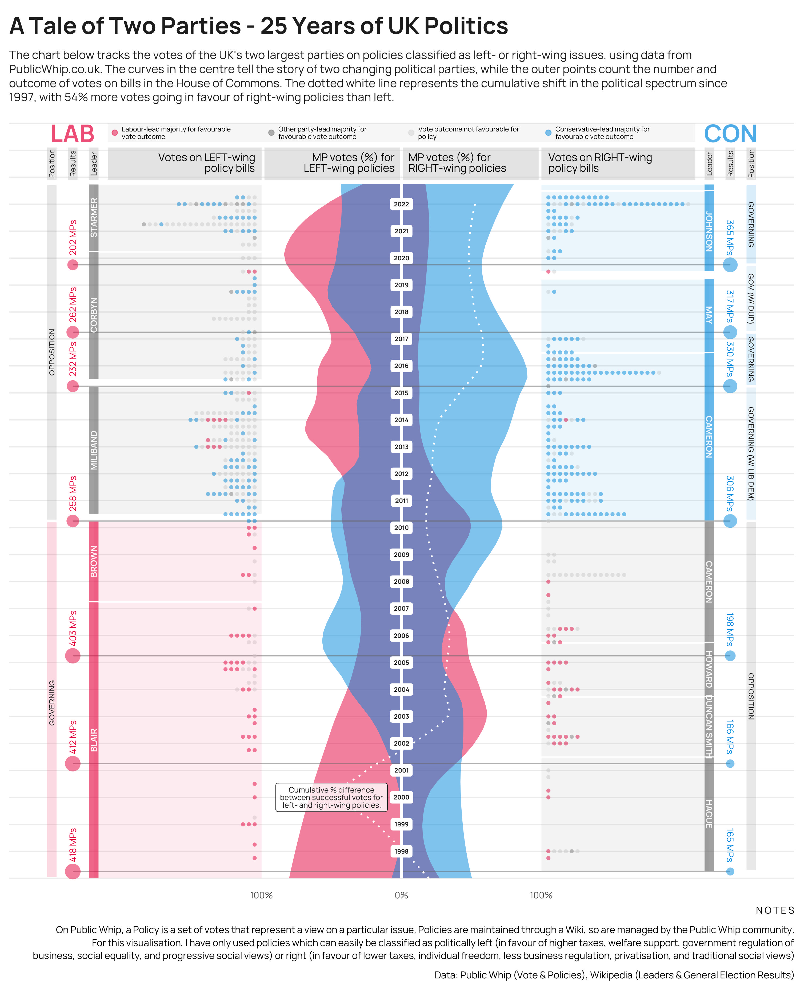

A Tale of Two Parties
================
2022-11-02

## Visualisation

## Data

Policies and parliament votes data were scraped using the rvest package
from [Public Whip](https://www.publicwhip.org.uk/)

<table class="gt_table">
  
  <thead class="gt_col_headings">
    <tr>
      <th class="gt_col_heading gt_columns_bottom_border gt_left" rowspan="1" colspan="1" scope="col">House</th>
      <th class="gt_col_heading gt_columns_bottom_border gt_right" rowspan="1" colspan="1" scope="col">Date</th>
      <th class="gt_col_heading gt_columns_bottom_border gt_left" rowspan="1" colspan="1" scope="col">Subject</th>
      <th class="gt_col_heading gt_columns_bottom_border gt_left" rowspan="1" colspan="1" scope="col">Policy.vote</th>
      <th class="gt_col_heading gt_columns_bottom_border gt_left" rowspan="1" colspan="1" scope="col">PolicyLink</th>
      <th class="gt_col_heading gt_columns_bottom_border gt_left" rowspan="1" colspan="1" scope="col">Party</th>
      <th class="gt_col_heading gt_columns_bottom_border gt_left" rowspan="1" colspan="1" scope="col">Vote</th>
      <th class="gt_col_heading gt_columns_bottom_border gt_right" rowspan="1" colspan="1" scope="col">Vote.Count</th>
      <th class="gt_col_heading gt_columns_bottom_border gt_left" rowspan="1" colspan="1" scope="col">description</th>
      <th class="gt_col_heading gt_columns_bottom_border gt_left" rowspan="1" colspan="1" scope="col">policy_type</th>
      <th class="gt_col_heading gt_columns_bottom_border gt_left" rowspan="1" colspan="1" scope="col">political_leaning</th>
    </tr>
  </thead>
  <tbody class="gt_table_body">
    <tr><td class="gt_row gt_left">Commons</td>
<td class="gt_row gt_right">2002-06-11</td>
<td class="gt_row gt_left">Nationality, Immigration and Asylum Bill — Only allow destitute asylum seekers and those under residence restrictions to live in accommodation centres for a maximum of 10 weeks — rejected</td>
<td class="gt_row gt_left">MAJORITY</td>
<td class="gt_row gt_left">https://www.publicwhip.org.uk/division.php?date=2002-06-11&amp;house=commons&amp;number=263</td>
<td class="gt_row gt_left">Con</td>
<td class="gt_row gt_left">FOR</td>
<td class="gt_row gt_right">0</td>
<td class="gt_row gt_left">Make seeking asylum more difficult</td>
<td class="gt_row gt_left">Home Office</td>
<td class="gt_row gt_left">Right</td></tr>
    <tr><td class="gt_row gt_left">Commons</td>
<td class="gt_row gt_right">2002-06-11</td>
<td class="gt_row gt_left">Nationality, Immigration and Asylum Bill — Only allow destitute asylum seekers and those under residence restrictions to live in accommodation centres for a maximum of 10 weeks — rejected</td>
<td class="gt_row gt_left">MAJORITY</td>
<td class="gt_row gt_left">https://www.publicwhip.org.uk/division.php?date=2002-06-11&amp;house=commons&amp;number=263</td>
<td class="gt_row gt_left">Con</td>
<td class="gt_row gt_left">OTHER</td>
<td class="gt_row gt_right">122</td>
<td class="gt_row gt_left">Make seeking asylum more difficult</td>
<td class="gt_row gt_left">Home Office</td>
<td class="gt_row gt_left">Right</td></tr>
    <tr><td class="gt_row gt_left">Commons</td>
<td class="gt_row gt_right">2002-06-11</td>
<td class="gt_row gt_left">Nationality, Immigration and Asylum Bill — Only allow destitute asylum seekers and those under residence restrictions to live in accommodation centres for a maximum of 10 weeks — rejected</td>
<td class="gt_row gt_left">MAJORITY</td>
<td class="gt_row gt_left">https://www.publicwhip.org.uk/division.php?date=2002-06-11&amp;house=commons&amp;number=263</td>
<td class="gt_row gt_left">Con</td>
<td class="gt_row gt_left">OTHER</td>
<td class="gt_row gt_right">0</td>
<td class="gt_row gt_left">Make seeking asylum more difficult</td>
<td class="gt_row gt_left">Home Office</td>
<td class="gt_row gt_left">Right</td></tr>
    <tr><td class="gt_row gt_left">Commons</td>
<td class="gt_row gt_right">2002-06-11</td>
<td class="gt_row gt_left">Nationality, Immigration and Asylum Bill — Only allow destitute asylum seekers and those under residence restrictions to live in accommodation centres for a maximum of 10 weeks — rejected</td>
<td class="gt_row gt_left">MAJORITY</td>
<td class="gt_row gt_left">https://www.publicwhip.org.uk/division.php?date=2002-06-11&amp;house=commons&amp;number=263</td>
<td class="gt_row gt_left">Con</td>
<td class="gt_row gt_left">OTHER</td>
<td class="gt_row gt_right">39</td>
<td class="gt_row gt_left">Make seeking asylum more difficult</td>
<td class="gt_row gt_left">Home Office</td>
<td class="gt_row gt_left">Right</td></tr>
    <tr><td class="gt_row gt_left">Commons</td>
<td class="gt_row gt_right">2002-06-11</td>
<td class="gt_row gt_left">Nationality, Immigration and Asylum Bill — Only allow destitute asylum seekers and those under residence restrictions to live in accommodation centres for a maximum of 10 weeks — rejected</td>
<td class="gt_row gt_left">MAJORITY</td>
<td class="gt_row gt_left">https://www.publicwhip.org.uk/division.php?date=2002-06-11&amp;house=commons&amp;number=263</td>
<td class="gt_row gt_left">Lab</td>
<td class="gt_row gt_left">FOR</td>
<td class="gt_row gt_right">342</td>
<td class="gt_row gt_left">Make seeking asylum more difficult</td>
<td class="gt_row gt_left">Home Office</td>
<td class="gt_row gt_left">Right</td></tr>
    <tr><td class="gt_row gt_left">Commons</td>
<td class="gt_row gt_right">2002-06-11</td>
<td class="gt_row gt_left">Nationality, Immigration and Asylum Bill — Only allow destitute asylum seekers and those under residence restrictions to live in accommodation centres for a maximum of 10 weeks — rejected</td>
<td class="gt_row gt_left">MAJORITY</td>
<td class="gt_row gt_left">https://www.publicwhip.org.uk/division.php?date=2002-06-11&amp;house=commons&amp;number=263</td>
<td class="gt_row gt_left">Lab</td>
<td class="gt_row gt_left">OTHER</td>
<td class="gt_row gt_right">0</td>
<td class="gt_row gt_left">Make seeking asylum more difficult</td>
<td class="gt_row gt_left">Home Office</td>
<td class="gt_row gt_left">Right</td></tr>
  </tbody>
  
  
</table>

General election and party leader information came from Wikipedia pages
for [Labour Party](https://en.wikipedia.org/wiki/Labour_Party_(UK)) and
[Conservative
Party](https://en.wikipedia.org/wiki/Conservative_Party_(UK))

## Left / Right Policies

On Public Whip, a “Policy” is a set of votes that represent a view on a
particular issue. Policies are maintained through a Wiki, so are managed
by the Public Whip community. For this visualisation, I have only used
policies which can easily be classified as politically left (in favour
of higher taxes, welfare support, government regulation of business,
social equality, and progressive social views) or right (in favour of
lower taxes, individual freedom, less business regulation,
privatisation, and traditional social views)
